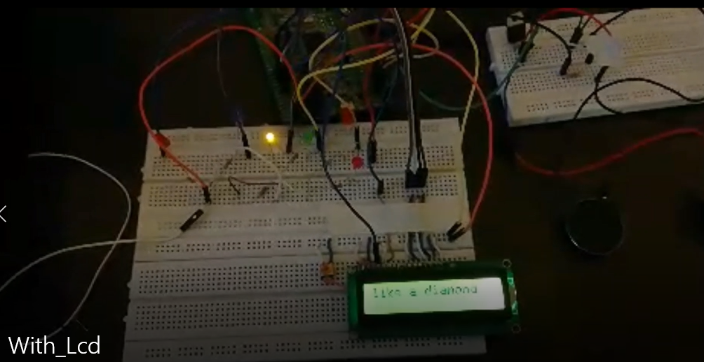

# Playing music notes using STM32F407VGT6
I used timers to make frequency for making notes then played jingle bells and twinkle little star song and
for every note, LCD showed the lyrics and LEDs turned on with every correspondent note
there is a video of this project in Video folder that you can watch (the language is Farsi) 

